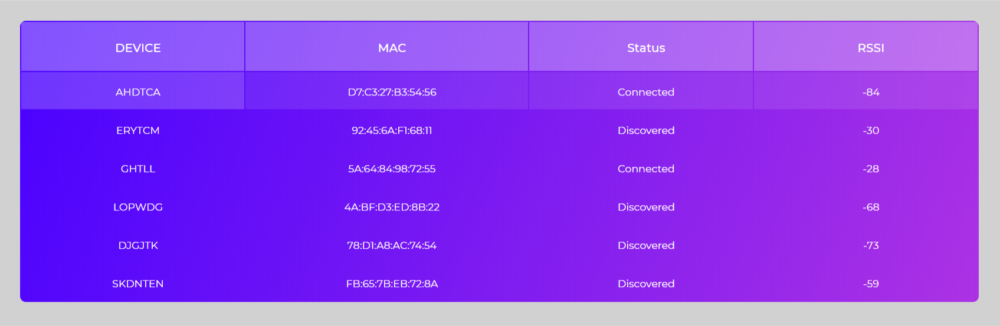

# Bluetooth-LE-Analyzer

## Table of Contents
- [About](#about)
- [Demo](#Demo)
- [Prerequisites](#Prerequisites)
- [Getting Started](#getting_started)
- [Author](#authors)

## About <a name = "about"></a>
Bluetooth low energy wireless technology an emerging specification and will change how the wireless world connects. Consuming only a fraction of the power of Basic Rate/Enhanced Data Rate Bluetooth wireless technology, it will allow hundreds of millions of new wireless devices to interoperate within the Bluetooth ecosystem. From watches, sports and fitness devices, to wellness, healthcare, and more, this new technology is expected to greatly accelerate the wireless evolution.

This Bluetooth low energy analyzer helps you pinpoint different bluetooth devices at a glance along with reading their status and characteristics with the hosted device.

## Demo <a name = "Demo"></a>
<p align="center">
  
</p>

### Prerequisites <a name = "Prerequisites"></a>
* Node.js
* Node Package Manager
* BlueZ 5.43
* Bash shell
* Expect scripting

## Getting Started <a name = "getting_started"></a>
Navigate into folder containing project using your Terminal (Mac & Linux) or Command Prompt (Windows).  Assuming you already have Node.js installed, run the following:

```
npm install
```

This will install all dependencies as defined in the **package.json** file.

## Author <a name = "authors"></a>
- [Akash Meshram](https://github.com/akashmeshram) - Idea & main work

## License
Copyright © 2019 [Akash Meshram](https://github.com/akashmeshram).<br />
This project is licensed under the MIT License - see the [LICENSE](./LICENSE) file for details
